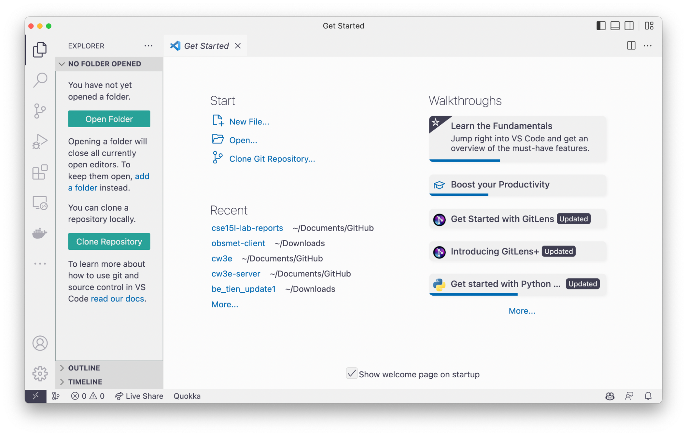
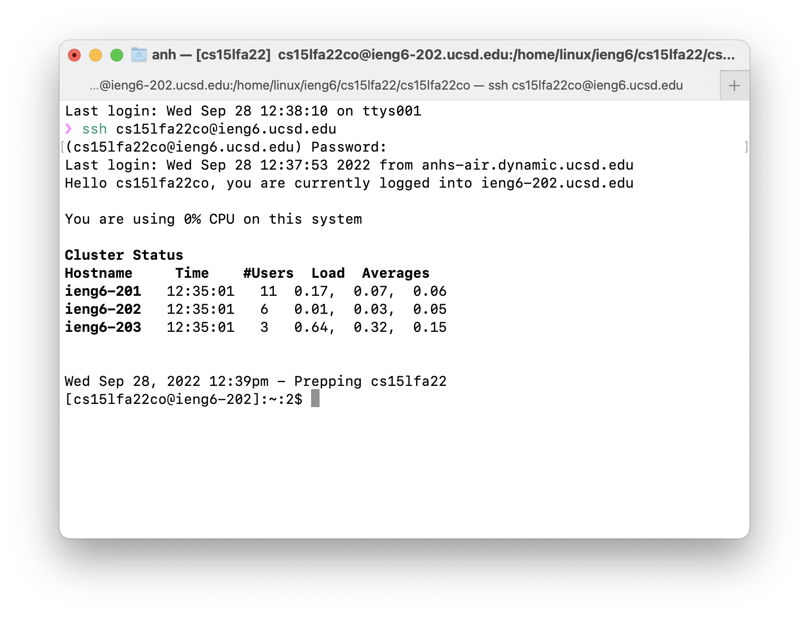
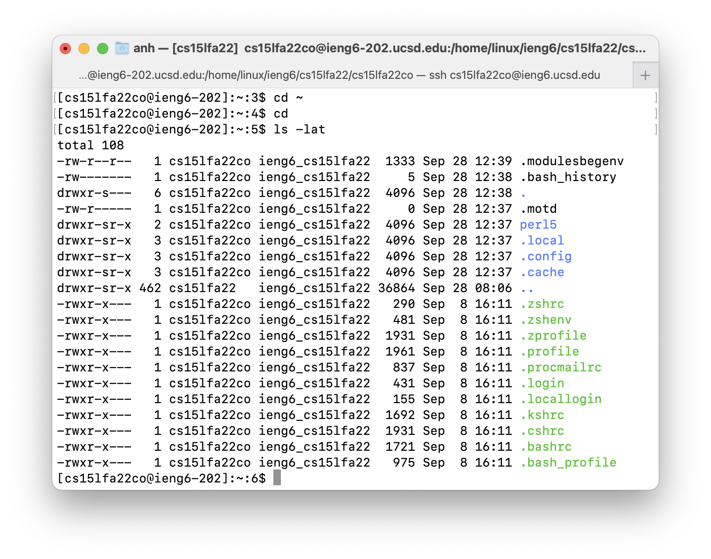
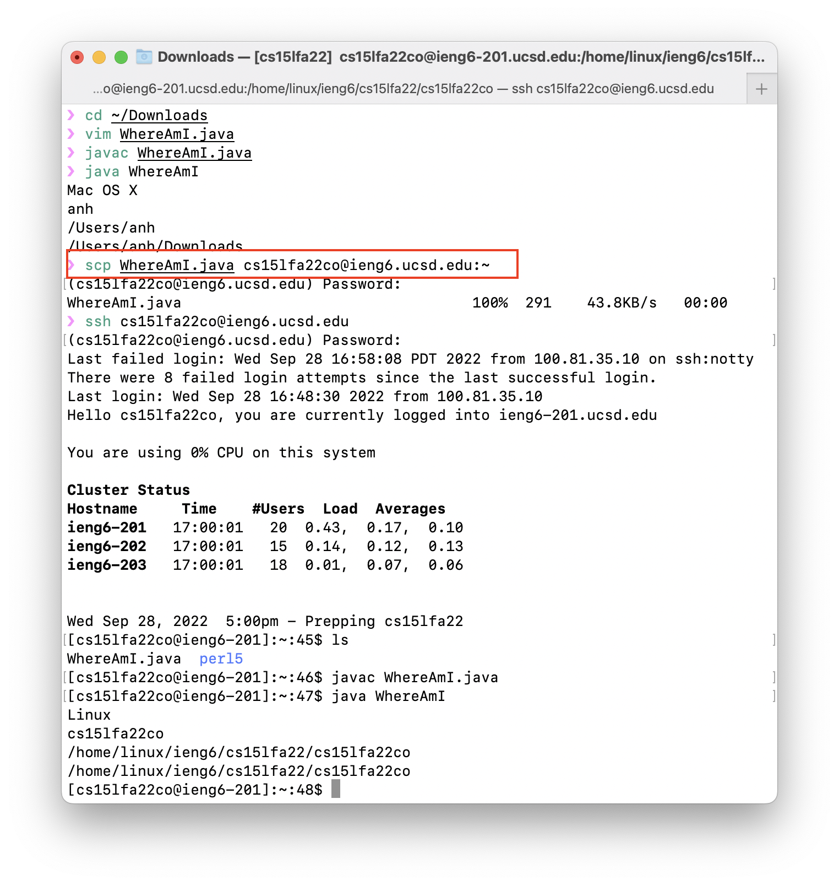
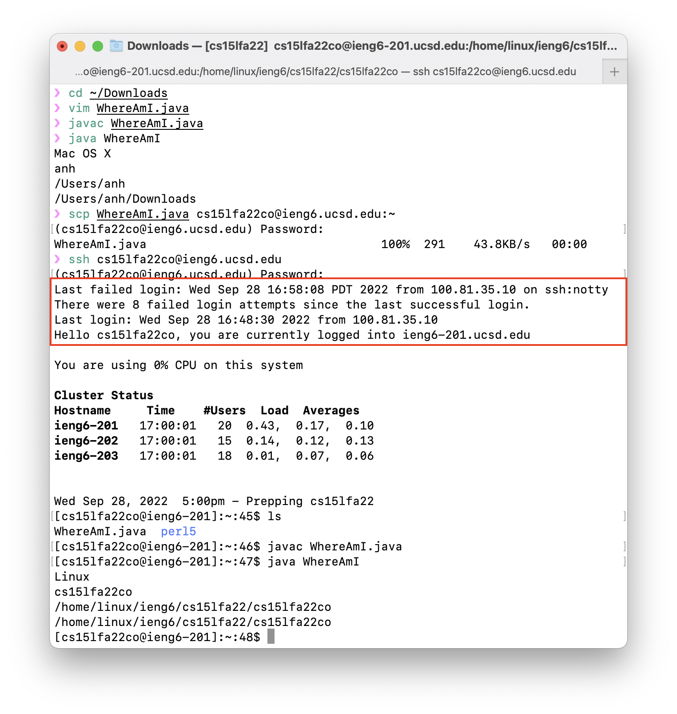
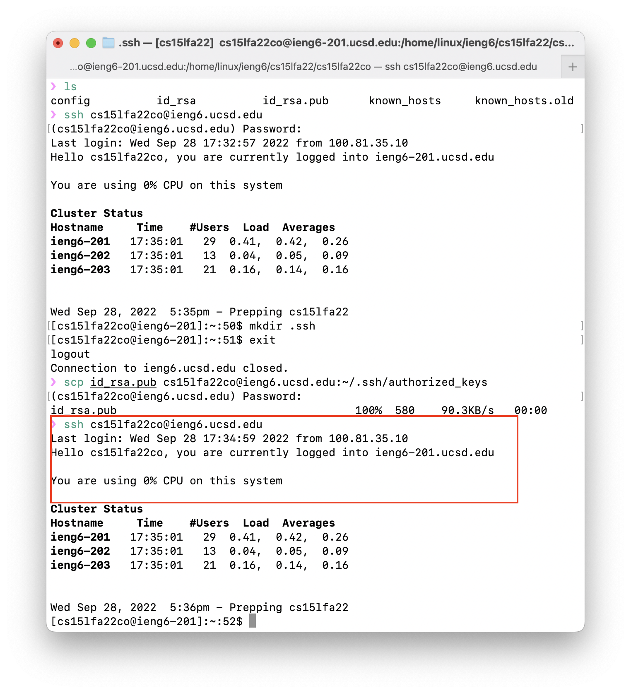
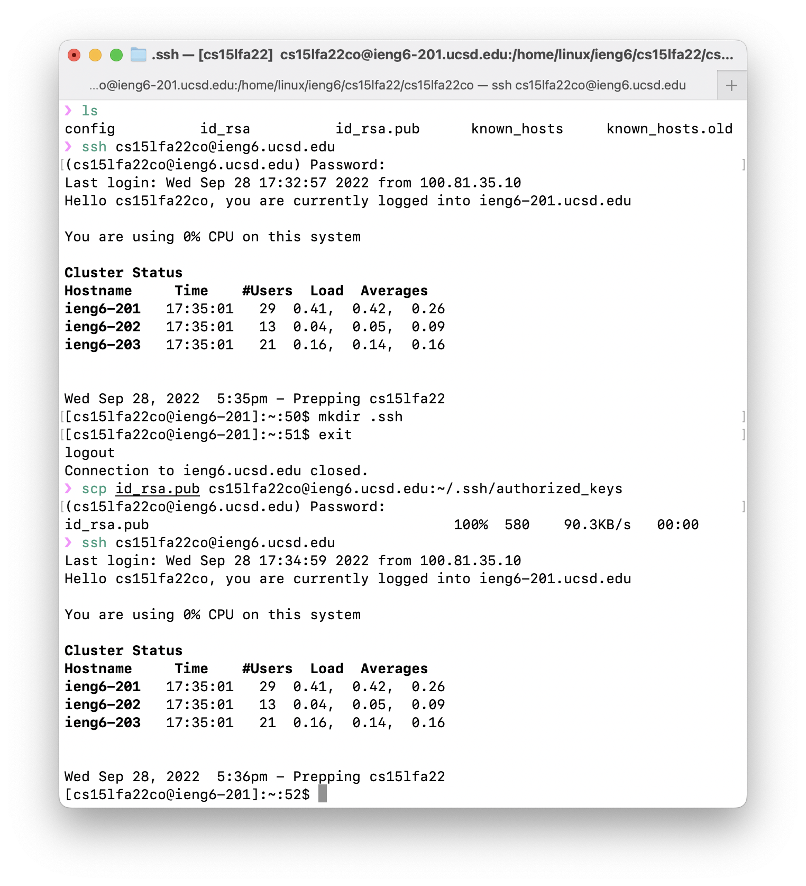

In this lab I learned how to set my computer up for remote access to the CSE lab computers and practice with commands that work with the filesystem.

# Table of Contents

1. [Installing VSCode](#installing-vscode)
2. [How to install](#how-to-install)
3. [Remotely Connecting](#remotely-connecting)
4. [Trying Some Commands](#trying-some-commands)
5. [Setting an SSH Key](#setting-an-ssh-key)
6. [Optimizing Remote Running](#optimizing-remote-running)

# Installing VSCode

## What is VSCode and Why VSCode?

Visual Studio Code is a lightweight, open-source code editor that is easy to use and has a lot of features.

It is also cross-platform, meaning that it can be used on Windows, Mac, and Linux. It is also free to use, and has a lot of extensions that can be used to customize the editor to your liking.

## How to install

You can find very clear installation instructions on VSCode website for the installation.

- Download VSCode at [Download](https://code.visualstudio.com/Download)
- Follow the platform-specific guides below:
  - [macOS](https://code.visualstudio.com/docs/setup/mac#_installation)
  - [Linux](https://code.visualstudio.com/docs/setup/linux#_installation)
  - [Windows](https://code.visualstudio.com/docs/setup/windows)

However, I often use package managers like brew on MacOS, or winget on windows to use less mouse action. So I will show you how to install VSCode using command line.

Currently, we do not need to use this code editor much. But in the future it helps a lot for programming as well as managing remote files in a very user-friendly way instead of the command line. It mean that it does not take a long time for any users to familiar with the UI and do not need to remember command line, which is often used by super-users.

```bash
# MacOS
brew install --cask visual-studio-code

# Windows
winget install -e --id Microsoft.VisualStudioCode
```

## Result:



# Remotely Connecting

## What is SSH?

SSH stands for Secure Shell. It is a protocol that allows you to securely connect to a remote computer. It is a very common protocol that is used to connect to remote servers.

## How to connect

To connect to a remote computer, you need to know the IP address of the remote computer. You can find the IP address of the remote computer by running the following command:

```bash
ssh <username>@<ip-address>
```

In this course your `<username>` will be `cs15lfa22xx`, where `xx` will be your code in this course. Where xx will be your code of course you could find it [here](https://sdacs.ucsd.edu/~icc/index.php). And `<ip-address>` in this quarter is `ieng6.ucsd.edu`.

Then a prompt will pop up asking for your password. Input your password and press Enter, the above connection to your remote computer will be connected.

_[The instruction on how to find, create, or reset passwords will be updated here](https://docs.google.com/document/d/1hs7CyQeh-MdUfM9uv99i8tqfneos6Y8bDU0uhn1wqho/edit.)._

_Note: the username and password could be changed in the future. So please check with the professor for the latest information._

For example, my code will How to get your username in Fall 2022 as shown here by professor. This way may change in the future but looking at the structure could be helpful.

## Result: Here are your first time login results to the remote server using SSH if you successfully connect to the server.



# Trying Some Commands

A few common commands to navigate and check directories. You can memorize it for faster action in the future.



Or play more with [linux command line cheat sheet](https://lmgtfy.app/?q=https%3A%2F%2Fwww.google.com%2Fsearch%3Fq%3Dlinux%2Bcommand%2Bline%2Bcheat%2Bsheet)

# Moving Files with scp

If you have VSCode installed, moving files back and forth from your remote computer and your client computer is as simple as **dragging and dropping** or **right-clicking and Download**.

However, in case you work with a new or a stranger's computer, this can be quite tricky. Below I will show you how to use `scp`, a command to move files between your computer and the computer.

## How to use scp

To move files from your computer to the remote computer, you can use the following command:

```bash
scp <file> <username>@<ip-address>:<destination>
```

## Example

Here is an example where I move a file of mine, which is named `WhereAmI.java` from my laptop to cse computer on the home `~` directory remotely with `scp`.



# Setting an SSH Key

## Why SSH Key?



If you notice, on the example above I logged in wrongly 8 times with the reason that my password was too long.

I think you will also encounter the same situation in the future. To prevent that from happening, you can use the `ssh-keygen` method to avoid using a password when making ssh connections to devices you trust.

## How to set up SSH Key

```bash
# on client (your computer)
ssh-keygen
<Enter Password>
```

Just press enter until you see `The key's randomart image is:`.

This will generate a public and private key pair. The public key will be stored in `~/.ssh/id_rsa.pub` and the private key will be stored in `~/.ssh/id_rsa`.

Now, we need to create a `.ssh` directory on the remote computer and copy the public key to the remote computer.

```bash
# on server (remote computer)
mkdir ~/.ssh
<logout>
```



Back on client, copy the public key to the `.ssh` folder that we created above.

```bash
# on client (your computer)
scp ~/.ssh/id_rsa.pub <username>@<ip-address>:~/.ssh/authorized_keys
```

Now, you can log in to the remote computer without a password.

## Result



# Optimizing Remote Running

In addition to using ssh-keygen to make the connection to the remote computer faster, there are some common commands, and shortcuts that you should keep in mind to move faster on the command window, such as:

- `Ctrl + A` to move to the beginning of the line
- `Ctrl + E` to move to the end of the line
- `Ctrl + U` to delete everything before the cursor
- `Ctrl + K` to delete everything after the cursor
- `Arrow Up` to move to the previous command

Combine commands together also makes using your command line much easier

Try to find out how to use these tasks in your command line:

- Write a command in quote at the end
- Use `&&` to combine two commands
- Use `|` to pipe the output of one command to the input of another command
- Use `>` to redirect the output of a command to a file
