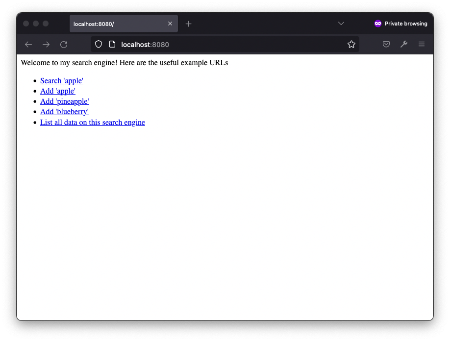
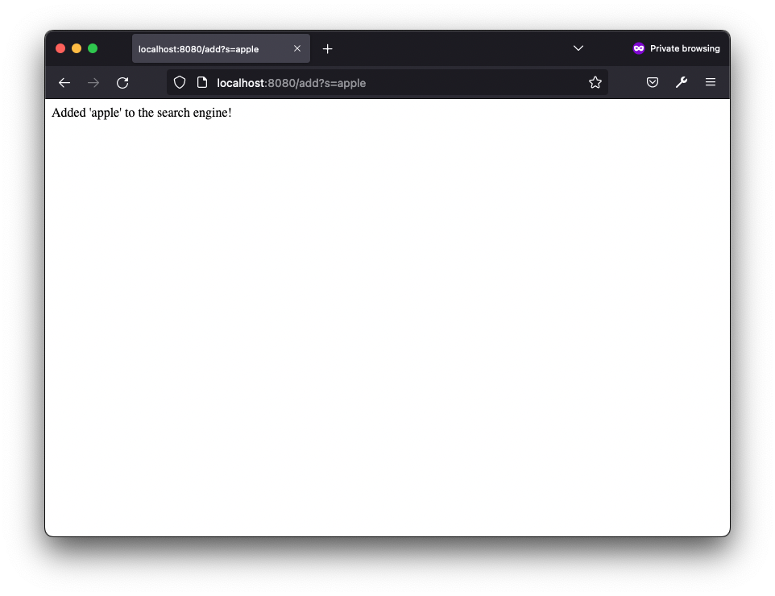
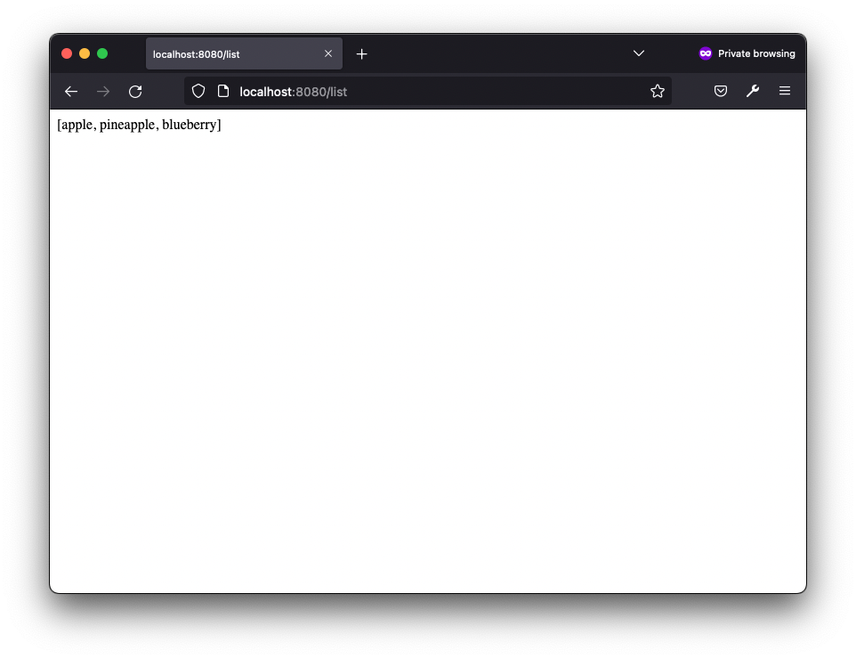
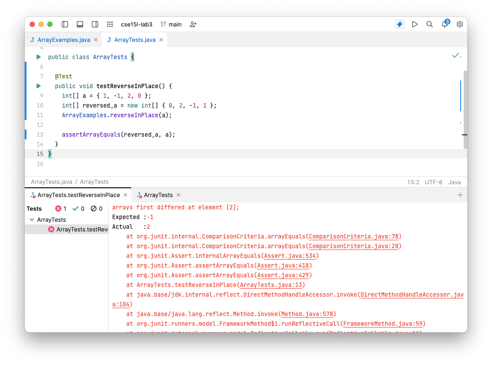
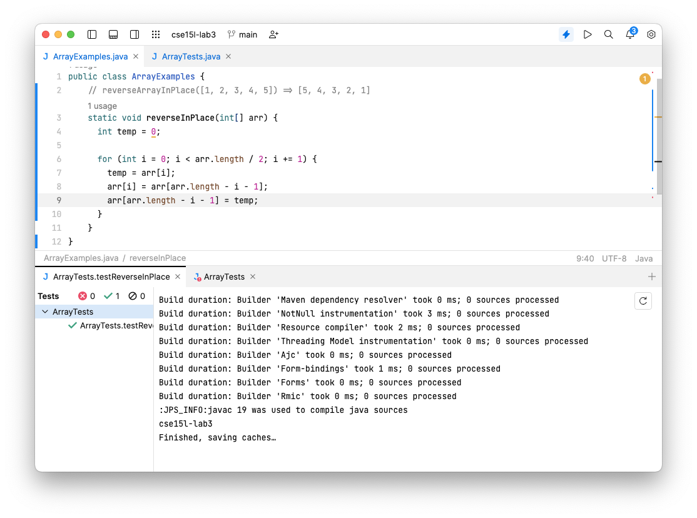
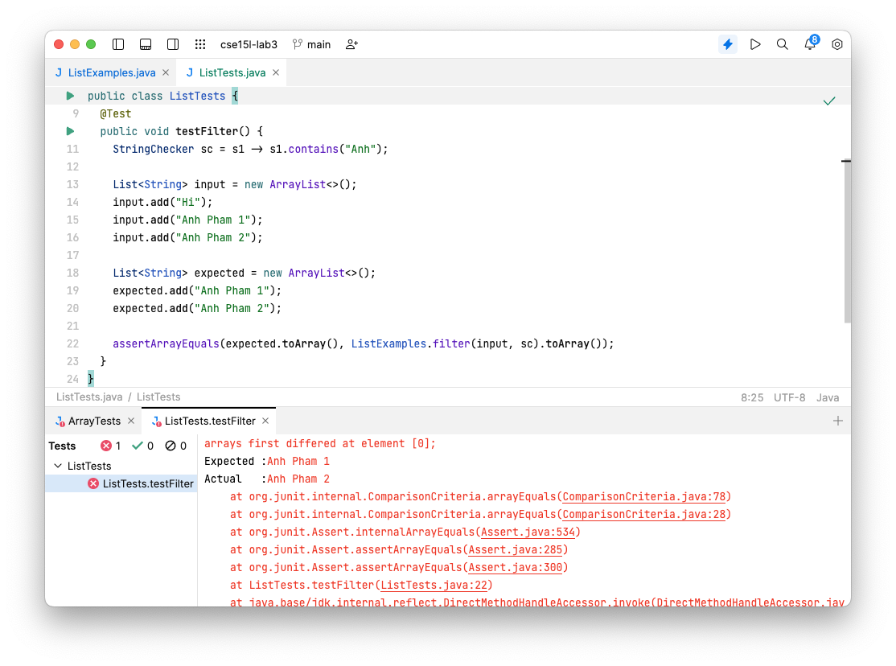
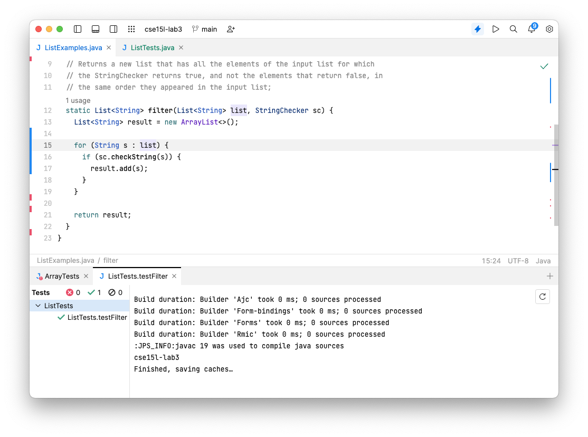

In this lab I learned how to set my computer up for remote access to the CSE lab computers and practice with commands that work with the filesystem.

# Table of Contents

1. [Part 1 - Make the Simplest “Search Engine”](#part-1-make-the-simplest-search-engine)
2. [Part 2 - Bugs](#part-2-bugs)

# Part 1: Make the Simplest “Search Engine”

## Setup server

You will need the [Server.java](https://raw.githubusercontent.com/ucsd-cse15l-f22/wavelet/master/Server.java)) in the same directory as the SearchEngine.java file below.

We tweaked the Server.java file to make it display in html format. The changes are:

```java
public void handle(final HttpExchange exchange) throws IOException {
    // form return body after being handled by program
    try {
        String ret = handler.handleRequest(exchange.getRequestURI());
        // form the return string and write it on the browser
+        exchange.getResponseHeaders().add("Content-Type", "text/html");
        exchange.sendResponseHeaders(200, ret.getBytes().length);
        ...
    } catch (Exception e) {
        ...
    }
}
```

## Search Engine Introduction

There are some routes that you can use to the search engine:

### Home Page



The home router show the main page or `/` will take no arguments.

```java
// Home router
if (url.getPath().equals("/")) {
    String welcome_msg = "Welcome to my search engine!\n Here are the useful example URLs you can try out:";

    welcome_msg += "<ul>";
    welcome_msg += "<li><a href='/search?s=apple'>Search 'apple'</a></li>";
    welcome_msg += "<li><a href='/add?s=apple'>Add 'apple'</a></li>";
    welcome_msg += "<li><a href='/add?s=pineapple'>Add 'pineapple'</a></li>";
    welcome_msg += "<li><a href='/add?s=blueberry'>Add 'blueberry'</a></li>";
    welcome_msg += "<li><a href='/list'>List all data on this search engine</a></li>";
    welcome_msg += "</ul>";

    return welcome_msg;
}
```

The search router show the main page or `/` will take no arguments.

### Search

Search page `/search` will show the search's results in the database that contain the `keyword` is passed thru the argument `s=`.

E.g. `/search?s=apple`


```java
// Search router
else if (url.getPath().equals("/search")) {

    String searchResult = "";

    String[] parameters = url.getQuery().split("=");
    if (parameters[0].equals("s")) {
        searchResult += "You searched for: " + url.getQuery() + "<br><br>";

        if (url.getQuery() != null) {
            String keyword = parameters[1];
            searchResult += " " + search(urls, keyword).toString().replace('[', ' ').replace(']', ' ');
        } else {
            searchResult += " and it was not found!";
        }
    }

    return searchResult;

}


/**
  * Handle search requests
  */
private ArrayList<String> search(ArrayList<String> list, String keyword) {
    ArrayList<String> results = new ArrayList<>();

    if (keyword == null) {
        return results;
    }

    for (int i = 0; i < list.size(); i++) {
        if (urls.get(i).contains(keyword)) {
            results.add(urls.get(i));
        }
    }

    return results;
}
```

### Add Router & Query

Search page `/add` will add the `data`, which is passed thru the argument `s=` to the database. And let the user know that the data is added.

E.g. `/add?s=apple`



```java
// Queries or 404
else {
    System.out.println("Path: " + url.getPath());

    if (url.getPath().contains("/add")) {
        String[] parameters = url.getQuery().split("=");
        if (parameters[0].equals("s")) {
            urls.add(parameters[1]);
            return "Added '" + parameters[1] + "' to the search engine!";
        }
    }
    return "404 Not Found!";
}
```

### List all data on the search engine database

The `/list` will show all the data that is stored in the database.



```java
// List router
else if (url.getPath().equals("/list")) {
    return urls.toString();
}
```

## Final Search Engine Code

```java
import java.io.IOException;
import java.net.URI;
import java.util.ArrayList;

class Handler implements URLHandler {

    ArrayList<String> urls = new ArrayList<String>();
    static int count = 0;

    public String handleRequest(URI url) {

        // Home router
        if (url.getPath().equals("/")) {
            String welcome_msg = "Welcome to my search engine!\n Here are the useful example URLs you can try out:";

            welcome_msg += "<ul>";
            welcome_msg += "<li><a href='/search?s=apple'>Search 'apple'</a></li>";
            welcome_msg += "<li><a href='/add?s=apple'>Add 'apple'</a></li>";
            welcome_msg += "<li><a href='/add?s=pineapple'>Add 'pineapple'</a></li>";
            welcome_msg += "<li><a href='/add?s=blueberry'>Add 'blueberry'</a></li>";
            welcome_msg += "<li><a href='/list'>List all data on this search engine</a></li>";
            welcome_msg += "</ul>";

            return welcome_msg;
        }

        // Search router
        else if (url.getPath().equals("/search")) {

            String searchResult = "";

            String[] parameters = url.getQuery().split("=");
            if (parameters[0].equals("s")) {
                searchResult += "You searched for: " + url.getQuery() + "<br><br>";

                if (url.getQuery() != null) {
                    String keyword = parameters[1];
                    searchResult += " " + search(urls, keyword).toString().replace('[', ' ').replace(']', ' ');
                } else {
                    searchResult += " and it was not found!";
                }
            }

            return searchResult;

        }
        // List router
        else if (url.getPath().equals("/list")) {
            return urls.toString();
        }

        // Queries or 404
        else {
            System.out.println("Path: " + url.getPath());

            if (url.getPath().contains("/add")) {
                String[] parameters = url.getQuery().split("=");
                if (parameters[0].equals("s")) {
                    urls.add(parameters[1]);
                    return "Added '" + parameters[1] + "' to the search engine!";
                }
            }
            return "404 Not Found!";
        }
    }

    /**
     * Handle search requests
     */
    private ArrayList<String> search(ArrayList<String> list, String keyword) {
        ArrayList<String> results = new ArrayList<>();

        if (keyword == null) {
            return results;
        }

        for (int i = 0; i < list.size(); i++) {
            if (urls.get(i).contains(keyword)) {
                results.add(urls.get(i));
            }
        }

        return results;
    }

}

class SearchEngine {
    static int DEFAULT_PORT = 8080;

    public static void main(String[] args) throws IOException {
        int port = DEFAULT_PORT;

        if (args.length == 1) {
            port = initPort(args[0]);
        }

        Server.start(port, new Handler());
    }

    private static int initPort(String port) {
        if (port == null) {
            return DEFAULT_PORT;
        }

        try {
            return Integer.parseInt(port);
        } catch (NumberFormatException e) {
            System.out.println("Invalid port number! Try any number between 1024 to 49151");
            return DEFAULT_PORT;
        } catch (Exception e) {
            return DEFAULT_PORT;
        }
    }
}
```

### How to complie and run

```bash
javac Server.java SearchEngine.java
java SearchEngine [port]
#e.g: java SearchEngine 8080
```

# Part 2: Bugs

You could find the example code at [Lab 3 - Example code](https://github.com/ucsd-cse15l-f22/lab3)

## Bug 1: Reverse Array in Place

### Code

```java
// ArrayExamples.java

/**
 * Changes the input array to be in reversed order
 * @param arr the input array
 */
static void reverseInPlace(int[] arr) {
    for(int i = 0; i < arr.length; i += 1) {
        arr[i] = arr[arr.length - i - 1];
    }
}

```

The failure-inducing input (the code of the test)

```java
// ArrayExamplesTest.java

  @Test
  public void testReverseInPlace() {
    int[] a = { 1, -1, 2, 0 };
    int[] reversed_a = new int[] { 0, 2, -1, 1 };

    ArrayExamples.reverseInPlace(a);
    assertArrayEquals(reversed_a, a);
  }
```

### Symtoms and The Bug

When we run the test, it fails. The error message is:



Focus on the error message, it says:

```js
arrays first differed at element [2];
Expected :-1
Actual   :2
...
```

We should expect `[0, 2, -1, 1]` for the reversed array of `[1, -1, 2, 0]`, but the actual result is different, so we could know that the array has been revered in the wrong order. Check out the code, we could find that the `reverseInPlace` method reverses the array in the wrong logic.

```
Expected :
[1, -1, 2, 0] -> [0, 2, -1, 1] -> [0, -1, 2, 1]

Actual   :
[1, -1, 2, 0] -> [0, -1, 2, 0] -> [0, 2, 2, 0] (cross the mid point) -> [0, 2, 2, 0]
```

As we can see the we could see that the array há crossed the mid point, so the array overwrites the value of the other half of the array.

### Fix 🐛

To reverse an array we only need to swap half of the array for the whole array to be reversed. We also need a temporary variable to store and reposition.

```java
// reverseArrayInPlace([1, 2, 3, 4, 5]) => [5, 4, 3, 2, 1]
  static void reverseInPlace(int[] arr) {
    int temp = 0;

    // Only need to swap half of the array for the whole array to be reversed
    for (int i = 0; i < arr.length / 2; i += 1) {
      temp = arr[i];

      arr[i] = arr[arr.length - i - 1];
      arr[arr.length - i - 1] = temp;
    }
  }
```



## Bug 2: Reverse Array in Place

### Code

```java
// ArrayExamples.java

/**
 * Changes the input array to be in reversed order
 * @param arr the input array
 */
static void reverseInPlace(int[] arr) {
    for(int i = 0; i < arr.length; i += 1) {
        arr[i] = arr[arr.length - i - 1];
    }
}

```

The failure-inducing input (the code of the test)

```java
// ListTests.java

import org.junit.Test;

import java.util.ArrayList;
import java.util.List;

import static org.junit.Assert.assertArrayEquals;

public class ListTests {

  @Test
  public void testFilter() {
    StringChecker sc = s1 -> s1.contains("Anh");

    List<String> input = new ArrayList<>();
    input.add("Hi");
    input.add("Anh Pham 1");
    input.add("Anh Pham 2");

    List<String> expected = new ArrayList<>();
    expected.add("Anh Pham 1");
    expected.add("Anh Pham 2");

    assertArrayEquals(expected.toArray(), ListExamples.filter(input, sc).toArray());
  }

}
```

### Symtoms and The Bug

When we run the test, it fails. The error message is:



Focus on the error message, it says:

```js
arrays first differed at element [0];
Expected :Anh Pham 1
Actual   :Anh Pham 2
...
```

We should expect `['Anh Pham 1', 'Anh Pham 2']` for the filter of the `'Anh'` keyword in the array of `['Hi', 'Anh Pham 1', 'Anh Pham 2']`, but the actual result is different, in wrong order. Check out the code, we could find that the `filter` method filter and add the result to the beginning of the array instead of the end of the array. Thereforem, the result is in the opposite order.

As we can see the we could see that the array has crossed the mid point, so the array overwrites the value of the other half of the array.

### Fix 🐛

```java
import java.util.ArrayList;
import java.util.List;

interface StringChecker { boolean checkString(String s); }

class ListExamples {

  // Returns a new list that has all the elements of the input list for which
  // the StringChecker returns true, and not the elements that return false, in
  // the same order they appeared in the input list;
  static List<String> filter(List<String> list, StringChecker sc) {
    List<String> result = new ArrayList<>();

    for(String s: list) {
      if(sc.checkString(s)) {
        result.add(s);
      }
    }

    return result;
  }

}
```


