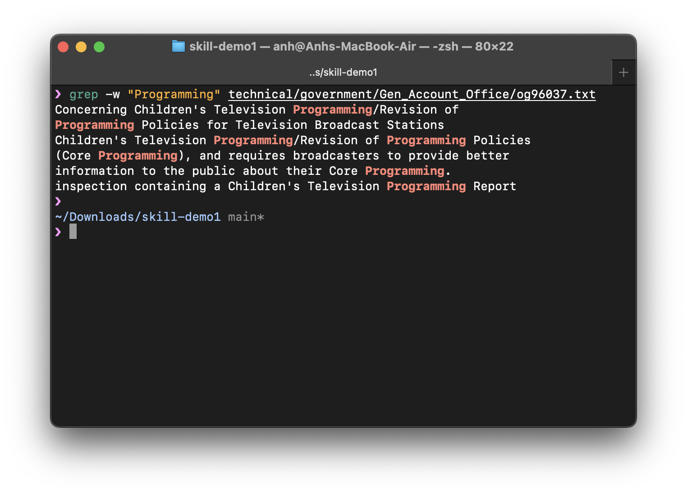
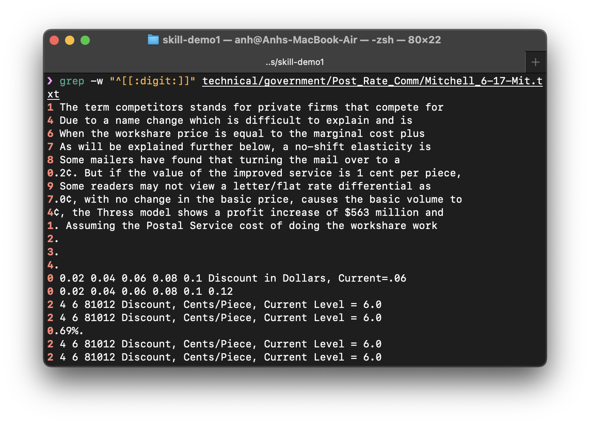
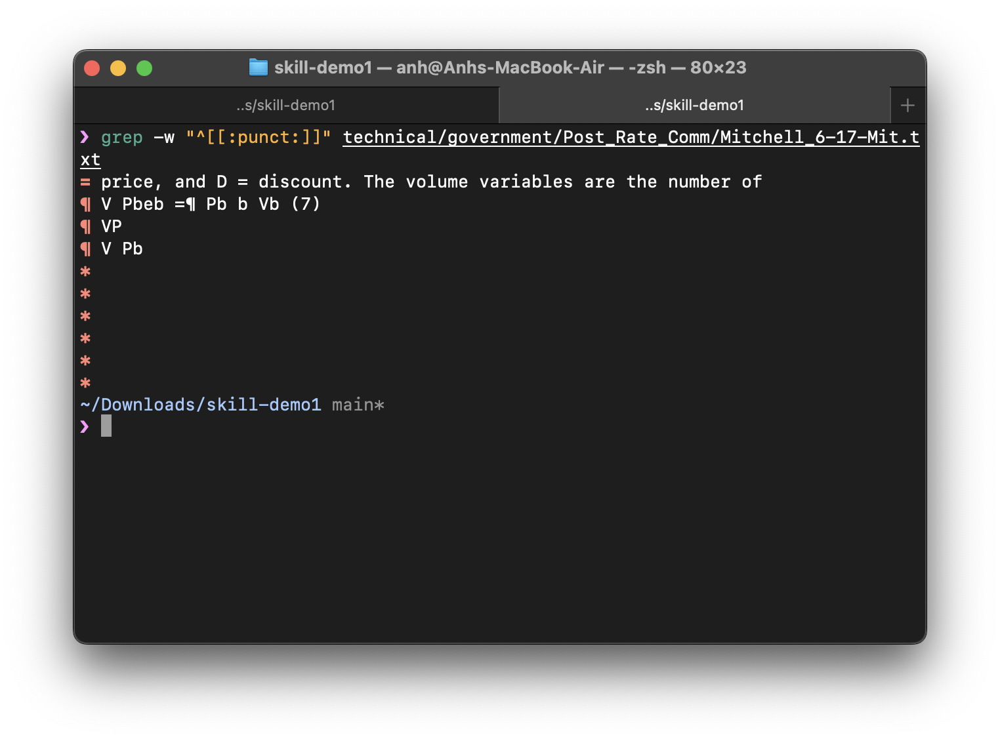
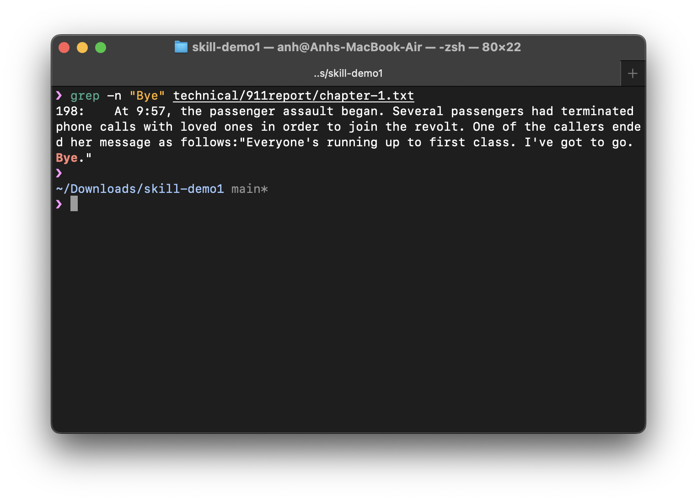
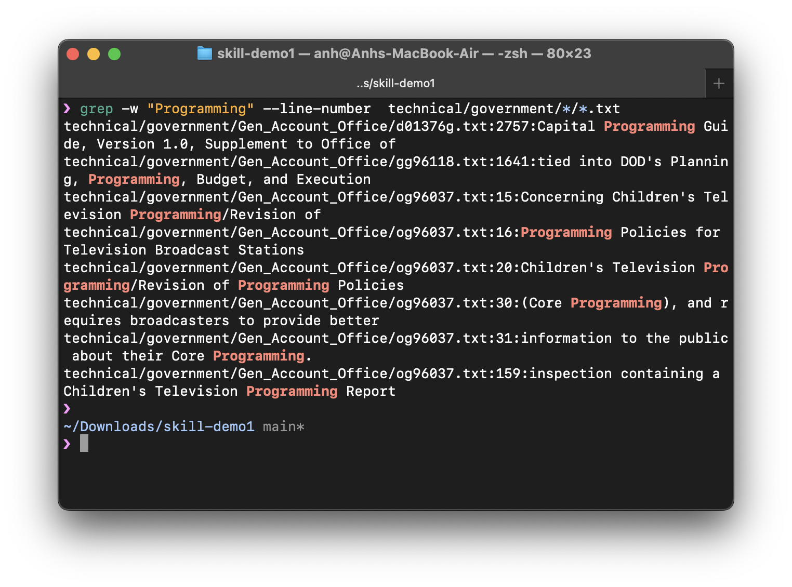
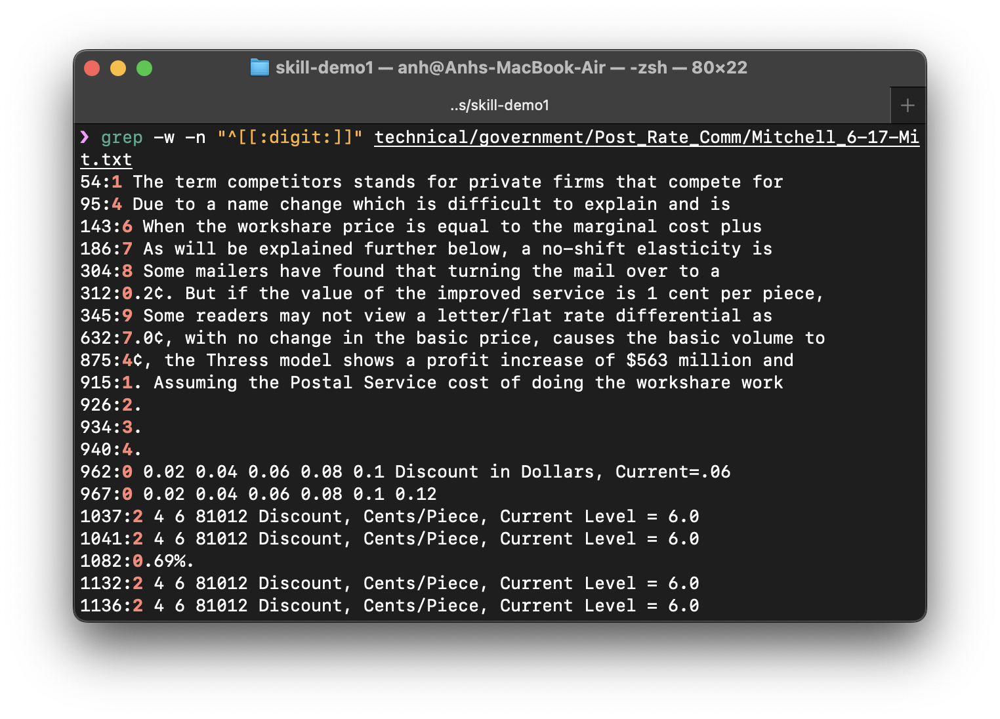
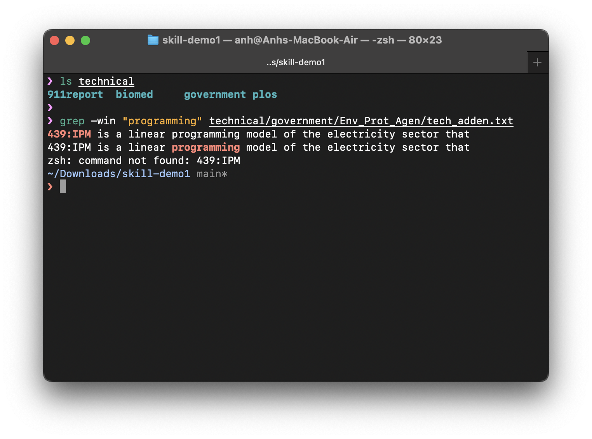
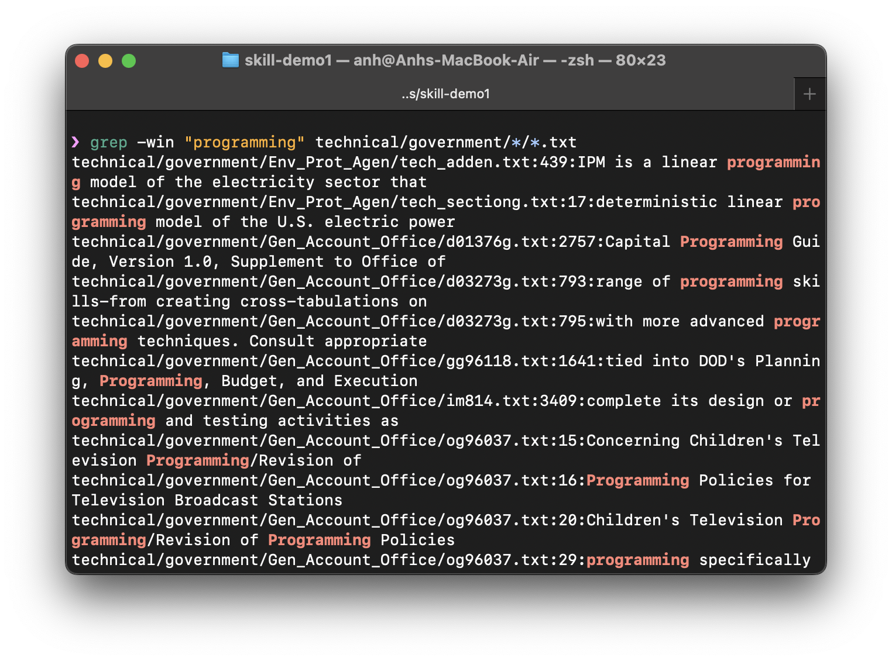
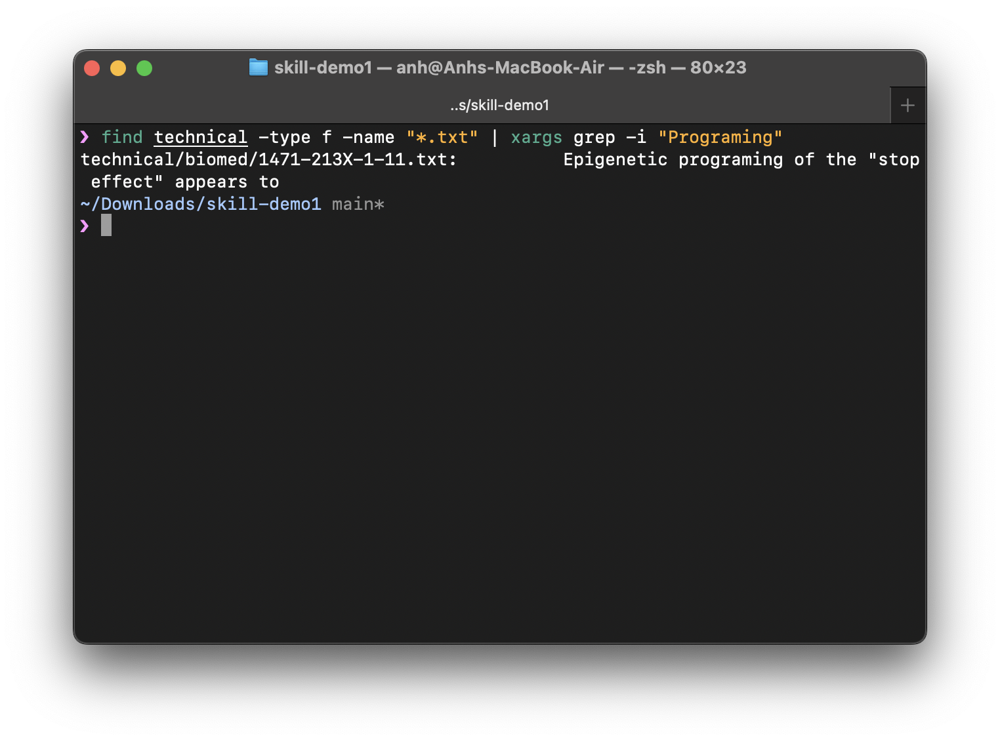

In this lab, I research commands for `grep`, a tool that helps you to find and replace text in files. It is a tool that is very useful for developers. It is also a tool that is very useful for me because I often need to find and replace text in files. Since the `technical` folder has a lot of text files (in `*.txt`), I will research commands for `grep` for the lab.

The folder `technical` of this lab can be found [here](https://github.com/ucsd-cse15l-f22/skill-demo1).

# 1. Word Regular Expression (-w)

`-w` or `--word-regexp` is used to match the whole word could be used with the regular expression (regex). I think this is the most useful flag for me since it not only to find the word but also using `regex` to find several words that have the same pattern or special cases, e.g. digits or punctuations.

## Find words that match

```bash
grep -w "<keyword>" <file>

# -- or --
grep --word-regexp "<keyword>" <file>


# E.g. Find words that match with `Programming`
# in `technical/government/Gen_Account_Office/og96037.txt`
grep -w "Programming" technical/government/Gen_Account_Office/og96037.txt
```



## Find digits in a text file

```bash
grep -w "^[[:digit:]]" <file>

# E.g. Find words that match with the digit type
# in `technical/government/Post_Rate_Comm/Mitchell_6-17-Mit.txt`
grep -w "^[[:digit:]]" technical/government/Post_Rate_Comm/Mitchell_6-17-Mit.txt
```



## Find punctuation characters in a text file

```bash
grep -w "^[[:punct:]]" <file>

# E.g. Find words that match with the punctuation
# in `technical/government/Post_Rate_Comm/Mitchell_6-17-Mit.txt`
grep -w "^[[:punct:]]" technical/government/Post_Rate_Comm/Mitchell_6-17-Mit.txt
```



# 2. Line Number (-n)

`-n` or `--line-number` prints the line number of each match. This is helpful because you can see the line number of the line of the matches and then find and work with that easily in the text editor later.

_Note: The line number counter is reset for each file processed. This option is ignored if `-c`, `-L`, `-l`, or `-q` is specified._

## Line number in one file

```bash
grep -n "<keyword>" <file>

# -- or --
grep --line-number "<keyword>" <file>

# E.g. Find line number of the line that contains the word `Bye`
# in `technical/911report/chapter-1.txt`
grep -n "Bye" technical/911report/chapter-1.txt
```



## Line number in lines contain the keyword

```bash
# E.g. Print the line number of each line that contains
# the word `Programming` in subfolder `technical/government/`
grep -w "Programming" --line-number  technical/government/*/*.txt
```



## Line number with digits

```bash
grep -n "<keyword>" <file>

# -- or --
grep --line-number "<keyword>" <file>

# E.g. Print the line number of each line that has digit in it
grep -w -n "^[[:digit:]]" technical/government/Post_Rate_Comm/Mitchell_6-17-Mit.txt
```



# 3. Ignore Case Sensitivity (-i)

`-i` or `--ignore-case` match the word with case insensitive. This is useful when you want to find the word with different cases. For example, if you want to find the word `programming` and `Programming`, because you do not know if it is located in the beginning or in the end of a sentence, you can use this flag.

## Case insensitive on one word

```bash
grep -i "<keyword>" <file>

# -- or --
grep --ignore-case "<keyword>" <file>

# Ignore case sensitivity (-i) when searching for the word `programming`
# & print the line number (-n) and has the word `programming` (-w).
# Could be written in short (-win).
grep -win "programming" <file>
```



## Case insensitive on multiple files

```bash
# Ignore case sensitivity (-i) when searching for the word `programming`
# & print the line number (-n) and has the word `programming` (-w).
# Could be written in short (-win).
grep -win "programming" technical/government/*/*.txt
```



## Using `grep` with `find`

```bash
# Find the first file in the `technical` directory that contain
# the word `programming` using `xargs`.
find technical -type f -name "*.txt" | xargs grep -i "Programing"
```


