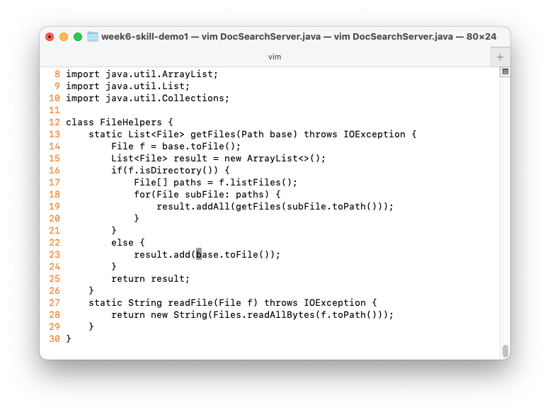
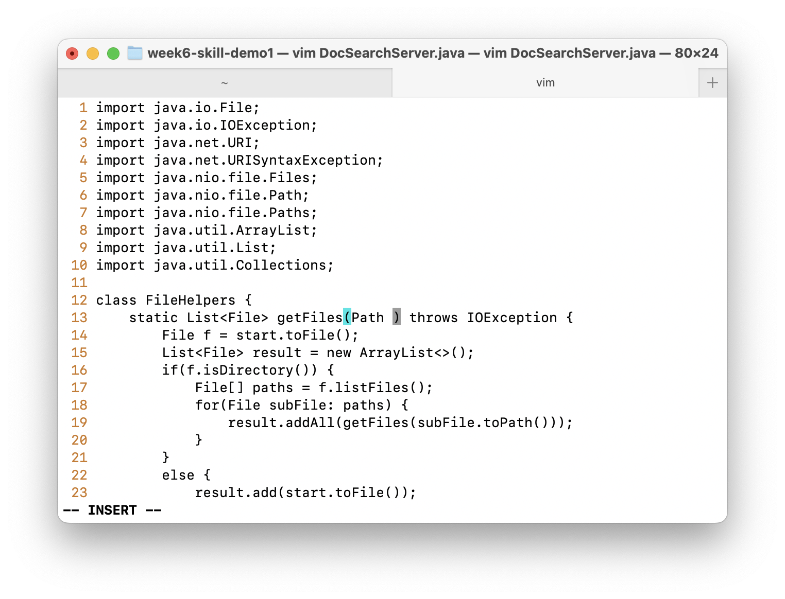
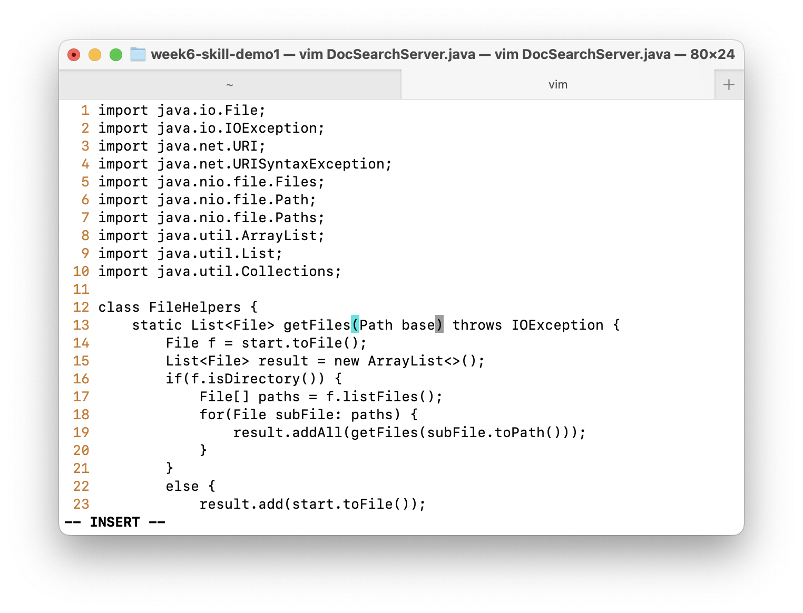
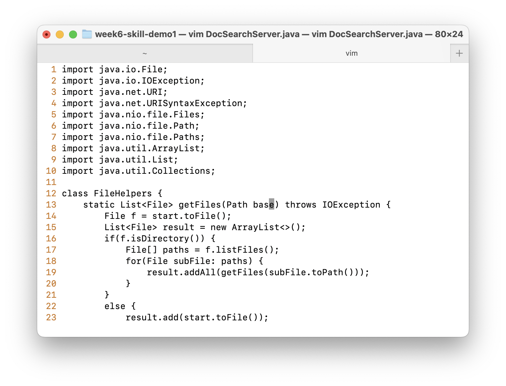

# Part 1. Changing the name of the `start` parameter and its uses to `base`

In DocSearchServer.java, change the name of the `start` parameter of getFiles, and all of its uses, to instead be called base.

`/` + `star` + `Enter` + `c` + `i` + `w` + `base` + `Esc` + `n` + `.` + `n` + `.`

Explain:

- `/` - search
  -> `star` - search for the word start
- `Enter` - go to the first occurrence of the word start
  
- `c` + `i` - `w` - change the word ( inner word)
  
- `base` - change the word to base
  
- `Esc` - exit insert mode
  

- `n` - go to the next occurrence of the word start
- `.` - repeat the last command (change the word to base)
  
  

The total number of keystrokes are `20`.

---

There are to other tasks in this lab I tried in this lab but hard to get it done in 30 keystrokes. So I will try to do it later.

2. Adding a new line to `print` before `File[] paths = f.listfiles()`

`/` + `path` + `Enter` + `k` + `Shift + A` + `Enter` + `Tab` + `Tab` + `system.out.println(f.toString());`

3. Changing the `main` method to take a command-line argument

`:set number`

`/` + `m` + `a` + `i` + `n` + `Enter`

:75 + Enter

`+ i + Enter + Tab`

`:` + `4` + `0` + `Enter` + `url` + `Enter` + `e` + `a` + `S` + `t` + `r` + `i` + `n` + `g` + `p` + `a` + `t` + `h` + `Esc` + `/` `tech` + `Enter` + `h` + `h` + `d` + `f` + `"` + `insert` + `path`

---

# Part 2: Time yourself twice

- Once, start in Visual Studio Code and make the edit there, then scp the file to the remote server and run it there to confirm it works (you can just run bash test.sh on the remote to test it out). Consider having the appropriate scp command in your command history or easily copy-pasteable!

- Second, start already logged into a ssh session. Then, make the edit for the task you chose in Vim, then exit Vim and run bash test.sh.

It takes me 36 seconds to complete the tasks in VS Code and using scp to copy the file to the server. It takes me 15 seconds to complete the tasks in Vim on the server.

I think that it depends on the use. Git would make the change easier in tracking the files in both world. However, in the case that we have to use `scp` or `vim`. I think vim works much better and faster since I do not have to remember the file location on the server, which is hard to keep track. `Vim` is usually used on the command or work with the linux server with no GUI, and `vim`/ `vi` is already there and ready to work with. Further, on some server, we do not have the permission to install any other apps/ tools. However, there is a case that you already change multiple files and places on a file on local and you want to copy it/ them to the server. In this case, I think `scp` is better since it is hard to remember which ones you already changed.
