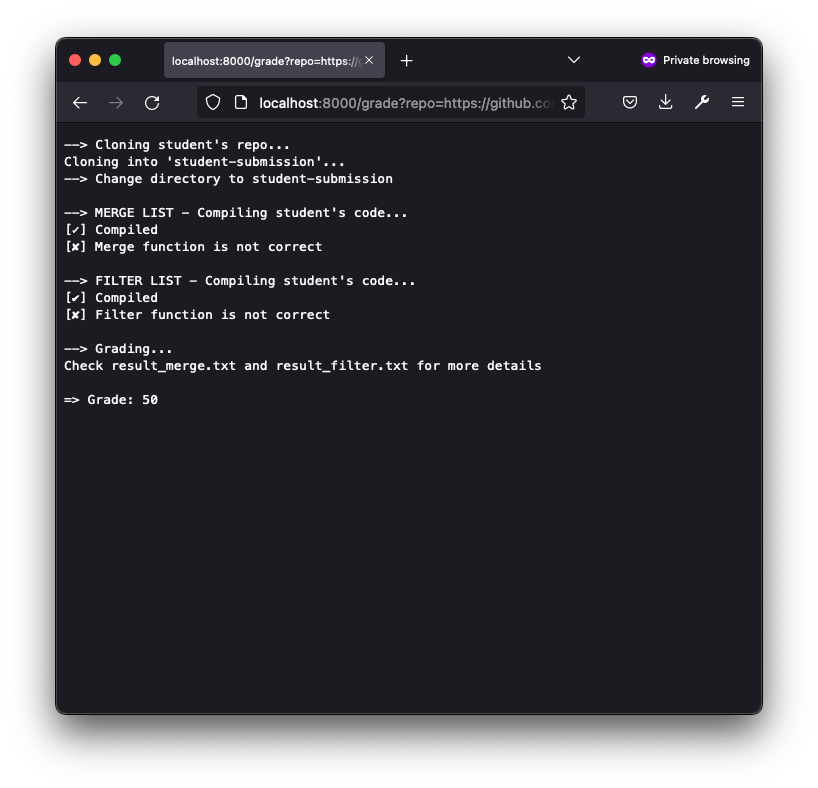
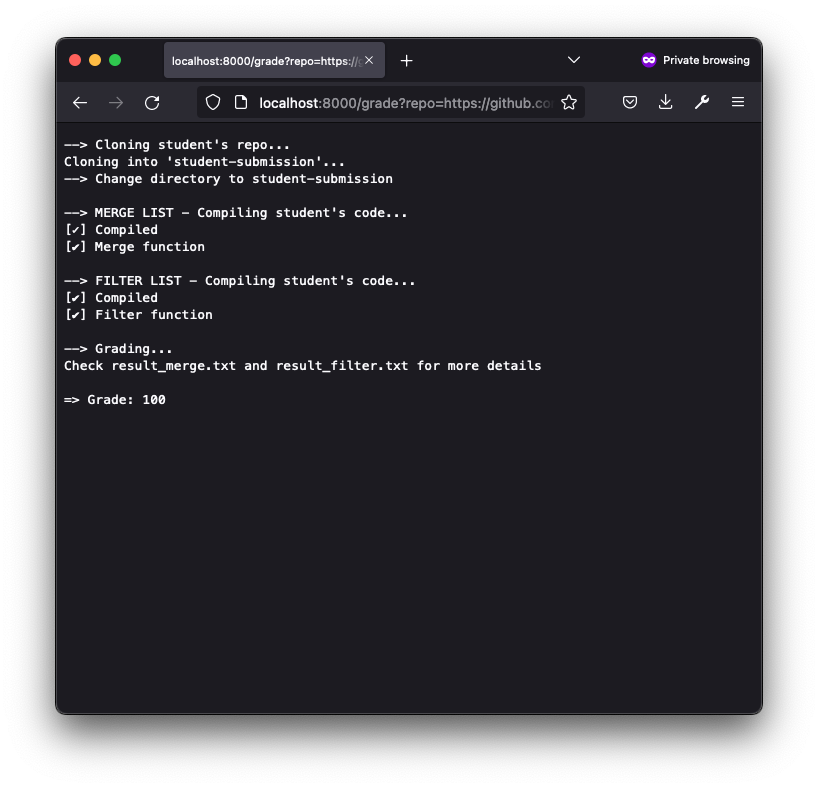
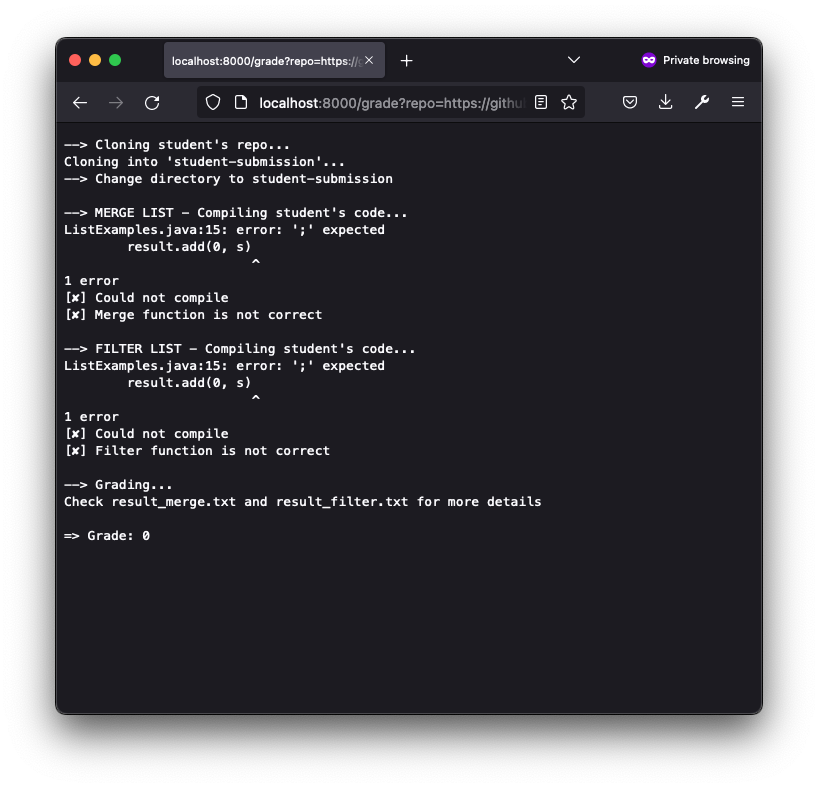
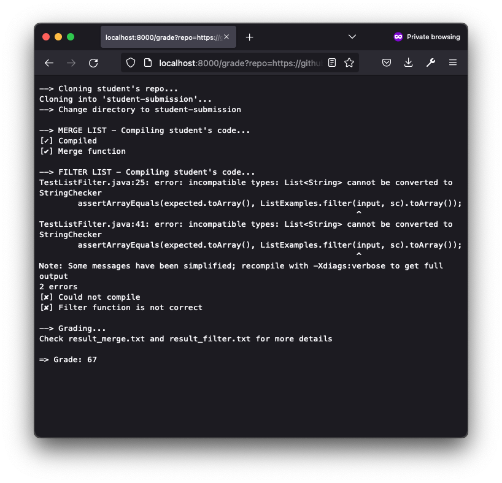

# Part 1. Bash Scripting

```bash
# set -e

# GRADING SCRIPT VARIABLES
CORE_PATH=$PWD/lib/hamcrest-core-1.3.jar
JUNIT_PATH=$PWD/lib/junit-4.13.2.jar

GRADING_PATH=student-submission
GRADING_FILE=ListExamples
MERGE_LIST_GRADER=TestListMerge
FILTER_LIST_GRADER=TestListFilter

GRADES=0
ERRORS=0
TOTAL_TESTS=0

# Clean up any old files
rm -f *.class
rm -f $GRADING_FILE
rm -rf $GRADING_PATH

# Clone the student's repo
echo "--> Cloning student's repo..."
git clone $1 $GRADING_PATH
if [ $? -ne 0 ]; then
    echo "[✘] Could not clone the student's repo"
    exit 1
fi

# Check if the student has a ListExamples.java file
if [ ! -f $GRADING_PATH/$GRADING_FILE.java ]; then
    echo "[✘] No $GRADING_FILE.java file found"
    exit 1
fi

# Go into the student's submission directory
echo "--> Change directory to student-submission"
cd $GRADING_PATH

# <TEST MERGE LIST>
# Copy grader file into the student's repo
cp ../$MERGE_LIST_GRADER.java .

# Compile the student's code
echo ""
echo "--> MERGE LIST - Compiling student's code..."
javac -cp .:$CORE_PATH:$JUNIT_PATH *.java
if [ $? -ne 0 ]; then
    echo "[✘] Could not compile"
else
    echo "[✔] Compiled"
fi

# Run the student's tests
java -cp .:$CORE_PATH:$JUNIT_PATH org.junit.runner.JUnitCore $MERGE_LIST_GRADER &> result_merge.txt
if [ $? -ne 0 ]; then
    echo "[✘] Merge function is not correct"
else
    echo "[✔] Merge function"
fi

# Clean up the previous test
rm -f *.class
rm -f $MERGE_LIST_GRADER.java

# <TEST FILTER LIST>
# Copy grader file into the student's repo
cp ../$FILTER_LIST_GRADER.java .

# Compile the student's code
echo ""
echo "--> FILTER LIST - Compiling student's code..."
javac -cp .:$CORE_PATH:$JUNIT_PATH *.java
if [ $? -ne 0 ]; then
    echo "[✘] Could not compile"
else
    echo "[✔] Compiled"
fi

# Run the student's tests
java -cp .:$CORE_PATH:$JUNIT_PATH org.junit.runner.JUnitCore $FILTER_LIST_GRADER &> result_filter.txt
if [ $? -ne 0 ]; then
    echo "[✘] Filter function is not correct"
else
    echo "[✔] Filter function"
fi

# Give the student a grade
# Sanitize the output
cat result_merge.txt | head -n 2 | tail -n 1 >> grade.txt
cat result_filter.txt | head -n 2 | tail -n 1 >> grade.txt

# Calculate the grade
echo ""
echo "--> Grading..."
ERRORS=$(grep -o 'E' grade.txt | wc -l | xargs)
TOTAL_TESTS=$(grep -o '\.' grade.txt | wc -l | xargs)
GRADES=$(( 100 - ($ERRORS * 100 / $TOTAL_TESTS) ))

# Print the student's grade
echo "Check result_merge.txt and result_filter.txt for more details"
echo ""
echo "[$TOTAL_TESTS tests] [$ERRORS errors]"
echo "=> Grade: $GRADES"
```

# Part 2. Example Output

- [https://github.com/ucsd-cse15l-f22/list-methods-lab3](https://github.com/ucsd-cse15l-f22/list-methods-lab3), which has the same code as the starter from lab 3



- [https://github.com/ucsd-cse15l-f22/list-methods-corrected](https://github.com/ucsd-cse15l-f22/list-methods-corrected), which has the methods corrected (I would expect this to get full or near-to-full credit)



- [https://github.com/ucsd-cse15l-f22/list-methods-compile-error](https://github.com/ucsd-cse15l-f22/list-methods-compile-error), which has a syntax error of a missing semicolon. Note that your job is *not* to fix this, but to decide what to do in your grader with such a submission!



- [https://github.com/ucsd-cse15l-f22/list-methods-signature](https://github.com/ucsd-cse15l-f22/list-methods-signature), which has the types for the arguments of `filter` in the wrong order, so it doesn’t match the expected behavior.



# Part 3. Tracing Script

Choose `list-methods-signature` in the examples I showed in screenshot, and describe a trace of what your grade.sh does on that example.

To trace the script, describe:

For each line with a command, what its standard output and standard error are for this run, and whether its return code was zero or nonzero
For each line with an if statement, whether the condition was true or false, and why
Indicate each line that does not run (maybe because it is in an if branch that doesn’t evaluate, or after an early exit)

---

Script with line numbers:


### Lines do not run

- **Because of comment or blank line:**

  - 1-3
  - 11
  - 15-16
  - 20-21
  - 28-29
  - 34-35
  - 38-40
  - 42-43
  - 52-53
  - 60-61
  - 64-66
  - 68-69
  - 78-79
  - 86-88
  - 91-92
  - 98-99

- **Because of the close `fi` and `else`**

  - 27
  - 33
  - 49
  - 51
  - 57
  - 59
  - 75
  - 77
  - 83
  - 85

- **Because of not fall to the condition**
  - 25-26
  - 31-32
  - 48
  - 56
  - 76
  - 84

### Standard output and standard error

| Lines            | Stdout                                                        | Stderr                                                 | Exit Code | Reason                               |
| ---------------- | ------------------------------------------------------------- | ------------------------------------------------------ | --------- | ------------------------------------ |
| 4-5, 7-10, 12-14 |                                                               |                                                        | 0         | Assign Variables                     |
| 17-19            |                                                               |                                                        | 0         | rm                                   |
| 22               | -> Cloning student's repo…                                    |                                                        | 0         |                                      |
| 23               |                                                               | Cloning into 'student-submission'…                     | 0         |                                      |
| 24 (false)       |                                                               |                                                        | 0         |                                      |
| 30 (false)       |                                                               |                                                        | 0         |                                      |
| 36               | -> Change directory to student-submission                     |                                                        | 0         |                                      |
| 37               |                                                               |                                                        | 0         |                                      |
| 41               |                                                               |                                                        | 0         |                                      |
| 44               | \n                                                            |                                                        | 0         |                                      |
| 45               | -> MERGE LIST - Compiling student's code…                     |                                                        | 0         |                                      |
| 46               |                                                               |                                                        | 0         |                                      |
| 47 (false)       |                                                               |                                                        |           |                                      |
| 50               | [✔] Compiled                                                  |                                                        | 0         |                                      |
| 54               |         |                                                        | 0         |                                      |
| 55 (false)       |                                                               |                                                        | 0         |                                      |
| 58               | [✔] Merge function                                            |                                                        | 0         |                                      |
| 62               |                                                               |                                                        | 0         | rm                                   |
| 63               |                                                               |                                                        | 0         | rm                                   |
| 67               |                                                               |                                                        | 0         | cp                                   |
| 70               | \n                                                            |                                                        | 0         |                                      |
| 71               | -> FILTER LIST - Compiling student's code…                    |                                                        | 0         |                                      |
| 72               |                                                               |  | 1         | compile error                        |
| 73 (true)        |                                                               |                                                        | 0         |                                      |
| 74               | [✘] Could not compile                                         |                                                        | 0         |                                      |
| 80               |         |                                                        | 1         | But write to `result_filter` success |
| 81 (true)        |                                                               |                                                        | 0         |                                      |
| 82               | [✘] Filter function is not correct                            |                                                        | 0         |                                      |
| 89               | ..                                                            |                                                        | 0         |                                      |
| 90               | .E                                                            |                                                        | 0         |                                      |
| 93               | \n                                                            |                                                        | 0         |                                      |
| 94               | -> Grading…                                                   |                                                        | 0         |                                      |
| 95-97            |                                                               |                                                        | 0         | Assign Variables                     |
| 100              | Check result_merge.txt and result_filter.txt for more details |                                                        | 0         |                                      |
| 101              | \n                                                            |                                                        | 0         |                                      |
| 102              | [3 tests] [1 errors]                                          |                                                        | 0         |                                      |
| 103              | => Grade: 67                                                  |                                                        | 0         |                                      |
